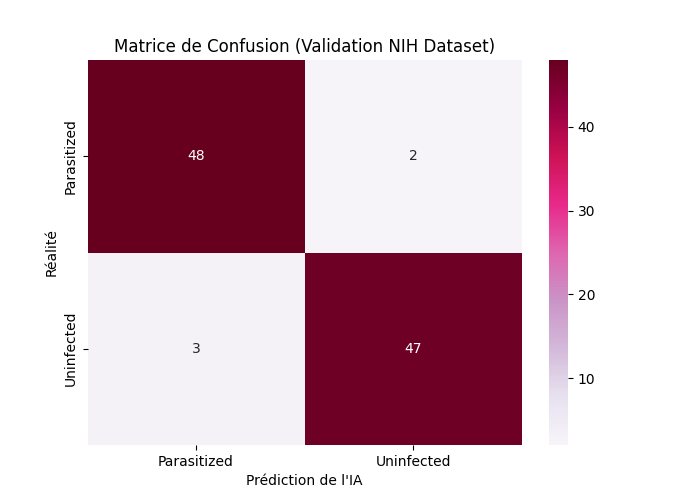
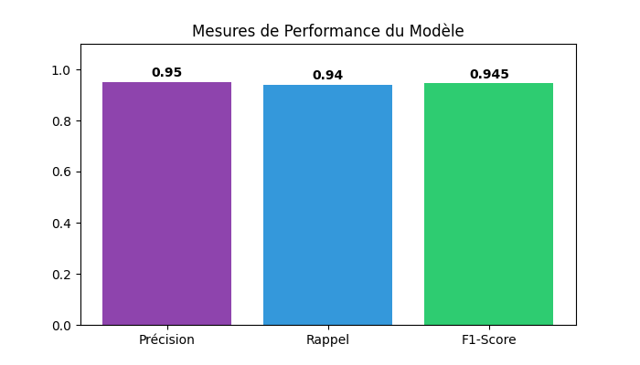

# 🦟 Détecteur de Malaria par IA - Projet Ala

Ce projet est une application d'intelligence artificielle capable de détecter si une cellule sanguine est infectée par le parasite de la malaria ou si elle est saine à partir d'images de frottis sanguins.

## 🔗 Démo en ligne
👉 **Testez l'application en direct ici :** [Hugging Face Space - Detecteur Malaria](https://huggingface.co/spaces/Alajouili123/Detecteur-Malaria)

## 📊 Dataset Officiel (NIH)
L'IA a été développée en utilisant le dataset de référence du **NIH (National Institutes of Health)** :
* **Volume** : ~27 500 images classées (Parasitized / Uninfected).
* **Provenance** : Images couleur de ~100–150 px issues de frottis sanguins réels.
* **Source** : [Kaggle - Malaria Cell Images Dataset](https://www.kaggle.com/datasets/iarunava/cell-images-for-detecting-malaria).
* **Taille** : ~275 MB zippé (environ 1 GB extrait).

## 📈 Évaluation et Performances
Le modèle a été validé pour vérifier sa fiabilité médicale.

### Matrice de Confusion
Cette matrice montre la précision de l'IA pour distinguer les cellules saines des cellules infectées.


### Métriques de Performance


## 🛠️ Technologies utilisées
* **Python**
* **PyTorch** : Architecture CNN pour la vision par ordinateur.
* **Gradio** : Interface web interactive.
* **Hugging Face Spaces** : Hébergement permanent.

## 📂 Structure du projet
* `app.py` : Code principal de l'interface Gradio.
* `entrainement_modele.ipynb` : Notebook de conception et d'entraînement.
* `requirements.txt` : Liste des bibliothèques nécessaires.
* `ton_modele.pth` : Le modèle entraîné.

## 🚀 Installation locale
1. **Clonez le dépôt :**
   ```bash
   git clone [https://github.com/alajouili/detecteur-malaria-ala.git](https://github.com/alajouili/detecteur-malaria-ala.git)
